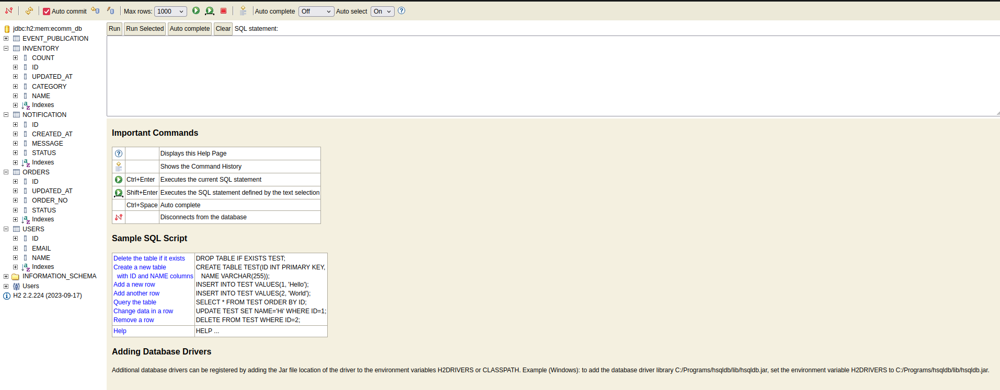
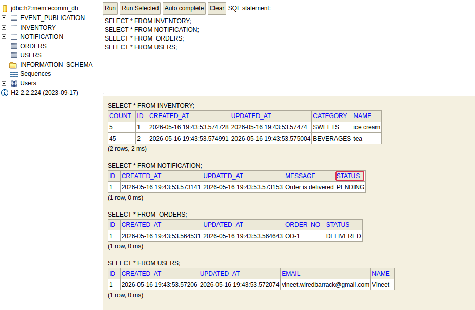
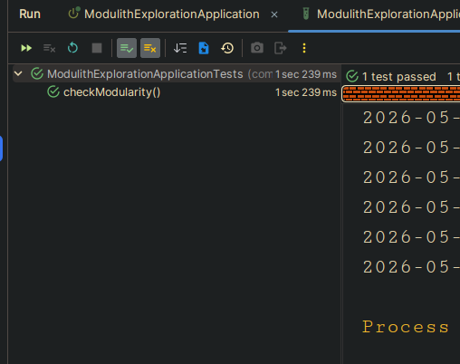

#  Exploring Spring Modulith
Welcome to first dispatch from the trenches of software architecture! Recently, I found myself wrestling with the age-old dilemma: to build a monolith or jump straight into microservices? That's when I stumbled upon a fascinating middle ground called **Spring Modulith**. 

In this series, I'll be sharing my hands-on exploration of Spring Modulith, unpacking how to integrate it, the features it brings to the table, and how we can leverage them to build better, more maintainable software.

## What Exactly is a 'Modulith'?

Before we dive into the code, let's get our terminology straight. We need to understand two foundational concepts:

1. **Monolith**: A single, large application that handles all responsibilities and business logic within itself.
2. **Modular**: An adjective describing a system made up of smaller, interchangeable pieces (modules). We can change one module without necessarily breaking or affecting the others.

So, if we take a monolithic application and design it in a highly modular way, we get a "modular-monolith"—or, a **'modulith'**. I suspect this was exactly Oliver Drotbohn's thought process when naming the Spring Modulith project.

Typically, when structuring an application, we look at two far ends of the spectrum:
* **Monolithic Architecture**: The entire application is one massive software block. It's easy to deploy but can become a tangled mess of code over time.
* **Microservices**: The system is scattered across various separate applications, each handling its own business domain, relying heavily on network communication. It scales well but introduces massive operational complexity.

The 'modulith' approach sits comfortably in the middle. It remains a single deployable application but strictly enforces a clear separation of concerns internally. This helps us achieve the Holy Grail of software design: **High Cohesion and Low Coupling**. 

> **A Quick Refresher:** High cohesion means code that changes together stays together. Low coupling means different parts of our system don't heavily depend on each other. We want a system where a change in our notification logic doesn't accidentally break our order processing!


## The E-Commerce Backend: A Practical Sandbox

To really understand Spring Modulith, theory isn't enough. We need to build something. So, we're going to build a backend for a dummy e-commerce service.

Historically, we might structure a project using **horizontal slices** (infrastructure-based):

```text
src
├── controllers               (The entry points - keep them thin!)
│   ├── OrderController
│   └── InventoryController
├── services                  (The business brains - keep them thick!)
│   ├── OrderService
│   └── InventoryService
└── repositories              (The persistence layer)
	├── OrderRepository
	└── InventoryRepository
```

This MVC pattern works fine initially. But as the project grows, services start talking to each other chaotically. Over time, `NotificationService` might start directly querying the `OrderRepository` to fetch delivered orders. Before we know it, refactoring becomes a dangerous nightmare because there are no clear business 'domains' a service is expected to adhere to.

Domain-Driven Design (DDD) suggests structuring by **vertical slices** (domain-based):

```text
src
├── orders
│   ├── OrderController
│   ├── OrderService
│   └── OrderRepository
├── inventory
│   ├── InventoryController
│   ├── InventoryService
│   └── InventoryRepository
└── notifications
	├── NotificationService
	└── NotificationRepository
```

This is better! It helps structure code defining domains each service and repository shall confine to. But there's a catch: **Java packages alone don't strictly enforce these boundaries**. A developer can still easily inject `OrderRepository` into `NotificationService` or directly query `orders` tables. Even if we try making repositories package-private, Java's nested packages (like `com.app.orders.internal`) are treated as completely separate packages, forcing us to make classes public anyway, thereby destroying our intended boundaries.

## Enter Spring Modulith

This is where Spring Modulith shines. It proposes that each domain should have internal implementations hidden from the outside world, and explicitly expose only public APIs for other domains to communicate with.

More importantly, it provides `ApplicationModuleTest`. This testing utility acts as an architectural enforcer, analyzing our component dependencies and failing our build if someone accidentally writes code that crosses defined domain boundaries. Keeping the project modular in the long term.

Beyond boundary enforcement, Modulith gives a way cross-domain communication will work—through application events. It allows running integration tests bootstrapping individual application modules in isolation, handles the passage of time (Moments API), provides durable events, and module-level observability APIs. We will discuss these in this series of articles—one at a time.

## Setting Up the Project

Let's get our hands dirty and jump into our dummy project. First, we add the Spring Modulith dependencies to our `pom.xml`. 

Spring Modulith consists of a set of libraries that can be used individually depending on which features we want. To ease declaration, we use the BOM (Bill of Materials) in our Maven POM:

```xml
<dependencyManagement>
	<dependencies>
		<dependency>
			<groupId>org.springframework.modulith</groupId>
			<artifactId>spring-modulith-bom</artifactId>
			<version>1.2.0</version>
			<scope>import</scope>
			<type>pom</type>
		</dependency>
	</dependencies>
</dependencyManagement>
```

For now, we will be using the Spring Modulith starter core, JPA, and tests. I am also using H2 DB for this:

```xml
<dependencies>
	<!-- Core Web Support -->
	<dependency>
		<groupId>org.springframework.boot</groupId>
		<artifactId>spring-boot-starter-web</artifactId>
	</dependency>

	<!-- Spring Modulith Starters -->
	<dependency>
		<groupId>org.springframework.modulith</groupId>
		<artifactId>spring-modulith-starter-core</artifactId>
	</dependency>
	<dependency>
		<groupId>org.springframework.modulith</groupId>
		<artifactId>spring-modulith-starter-jpa</artifactId>
	</dependency>
	
	<dependency>
		<groupId>com.h2database</groupId>
		<artifactId>h2</artifactId>
		<scope>runtime</scope>
	</dependency>

	<dependency>
		<groupId>org.springframework.modulith</groupId>
		<artifactId>spring-modulith-starter-test</artifactId>
		<scope>test</scope>
	</dependency>
</dependencies>
```

### The Startup Hiccup

Upon running this, I was immediately greeted with an error at startup:

```text
***************************
APPLICATION FAILED TO START
***************************

Description:

Parameter 0 of method jpaEventPublicationRepository in org.springframework.modulith.events.jpa.JpaEventPublicationConfiguration required a bean of type 'jakarta.persistence.EntityManager' that could not be found.

Action:

Consider defining a bean of type 'jakarta.persistence.EntityManager' in your configuration.
```

**The Fix:** The most likely reason for this is that the Maven project hasn't successfully resolved the core JPA dependencies. In a Spring Boot project, `spring-boot-starter-data-jpa` is the parent dependency that brings in `jakarta.persistence`. Ensure our `pom.xml` includes this explicitly, even though we have the Modulith JPA starter:

```xml
<dependency>
   <groupId>org.springframework.boot</groupId>
   <artifactId>spring-boot-starter-data-jpa</artifactId>
</dependency>
```

I also added the following properties in my `application.yml` to view the H2 console and tables in the web browser (`http://localhost:8080/h2-console/`):

```yaml
spring:
  h2:
	console:
	  enabled: true
	  path: /h2-console
	  settings:
		web-allow-others: true
  datasource:
	generate-unique-name: false # Ensures the name stays 'ecomm_db' without a suffix
```
We can see the h2-console at `http://localhost:8080/h2-console`




## Phase 01: Understanding Boundaries

*([Checkout commit here](https://github.com/Vineet-Singh-Chauhan/modulith_exploration/tree/83c1cae334684cd9928046619bb0fe861e3200af))*)

At this stage, we have files divided into packages based on domains. But if we look closely at `OrderService`, we'll notice it imports internal classes from other domains:

```java
package com.wiredbarrack.modulith_exploration.orders;

import com.wiredbarrack.modulith_exploration.inventory.internal.Inventory;
import com.wiredbarrack.modulith_exploration.inventory.internal.InventoryRepository;
import com.wiredbarrack.modulith_exploration.notifications.internal.Notification;
import com.wiredbarrack.modulith_exploration.notifications.NotificationService;
```

There are no boundaries enforced! The `order` domain is essentially querying the `Inventory` table directly and has a hard dependency upon `Notification`. (Don't mind the synchronous nature of notification here; it's just for showcasing the use case!)

Also, Our Modules look like below, Note one thing every thing is public here!
```
# Utility
> Logical name: utility
> Base package: com.wiredbarrack.modulith_exploration.utility
> Spring beans:
  + ?.DatabaseBackupUtility

# Orders
> Logical name: orders
> Base package: com.wiredbarrack.modulith_exploration.orders
> Spring beans:
  + ?.OrderDataSeeder
  + ?.OrderRepository
  + ?.OrderSevice

# Inventory
> Logical name: inventory
> Base package: com.wiredbarrack.modulith_exploration.inventory
> Spring beans:
  + ?.InventoryDataSeeder
  + ?.InventoryRepository
  + ?.InventoryService

# Notifications
> Logical name: notifications
> Base package: com.wiredbarrack.modulith_exploration.notifications
> Spring beans:
  + ?.NotificationDataSeeder
  + ?.NotificationRepository
  + ?.NotificationService

# Users
> Logical name: users
> Base package: com.wiredbarrack.modulith_exploration.users
> Spring beans:
  + ?.UserDataSeeder
  + ?.UserRepository
  + ?.UserService

```

Also, our modularity check passes:
```
	@Test
	void checkModularity(){
		ApplicationModules.of(ModulithExplorationApplication.class).verify();
	}
```

This is because any api that are part of base package are considered public, and thus can be accessed by other domains. 


We might argue that we can make things package-private and then expose domain services to communicate. We are right, but only to a certain extent!

*([Checkout commit here](https://github.com/Vineet-Singh-Chauhan/modulith_exploration/tree/ef4e9a4eeac348d5d915a799d11a42583e86b415))*

I refactored the code to have every domain exposing their respective service at the base package level and moved all repositories to `basePackage.internal`. Thus, we are saying: "Use services as the interface to communicate." But we can't natively enforce it because Java nested packages are considered separate packages altogether and cannot access methods even if they reside in the same parent package. We have to make them public, and once everything is public, no boundaries are enforced.

But here is the magic—if we see our Modulith test, it will fail now!

Check out how the classes at the base package level make up the public API, and nested classes and packages are enforced to be private:

```text
# Utility
> Logical name: utility
> Base package: com.wiredbarrack.modulith_exploration.utility
> Spring beans:
  + ….DatabaseBackupUtility

# Orders
> Logical name: orders
> Base package: com.wiredbarrack.modulith_exploration.orders
> Spring beans:
  + ….OrderSevice
  o ….internal.OrderDataSeeder
  o ….internal.OrderRepository

# Inventory
> Logical name: inventory
> Base package: com.wiredbarrack.modulith_exploration.inventory
> Spring beans:
  + ….InventoryService
  o ….internal.InventoryDataSeeder
  o ….internal.InventoryRepository
```

And look at the `ApplicationModuleTest` violations:

```text
org.springframework.modulith.core.Violations: 
- Module 'orders' depends on non-exposed type com.wiredbarrack.modulith_exploration.inventory.internal.Inventory within module 'inventory'!
Method <com.wiredbarrack.modulith_exploration.orders.OrderSevice.placeOrder> calls method <com.wiredbarrack.modulith_exploration.inventory.internal.Inventory.getCount()>
- Module 'orders' depends on non-exposed type com.wiredbarrack.modulith_exploration.inventory.internal.InventoryRepository within module 'inventory'!
- Module 'orders' depends on non-exposed type com.wiredbarrack.modulith_exploration.notifications.internal.Notification within module 'notifications'!
```

Spring Modulith strictly enforces us to follow domain boundaries!

## Fixing Modularity Tests

We have to remove direct cross-module dependencies and expose public APIs through services instead.

*([Checkout commit here](https://github.com/Vineet-Singh-Chauhan/modulith_exploration/tree/4829a3550bbe34d1589c03c5391db82c40212675))* 

I refactored the code to remove cross-domain boundaries. Also note that in `Order.java`, I had mistakenly placed `@Reference(to = Inventory.java)`. I removed it because we shouldn't have hard FK links in the DB to maintain complete modularity, and `@Reference` is technically meant for aggregate roots, not traditional SQL entities.

### The Foreign Key Dilemma

This brings up a massive architectural shift: **When we move to a modular architecture, we deliberately drop physical Foreign Key (FK) constraints at the database level between different modules. Instead, we rely on Logical Foreign Keys enforced by our application logic.**

**Architectural Takeaway:** Hard JPA mapping is for consistency within a single domain boundary. Loose ID reference is for scalability and isolation across domain boundaries.

```java
package com.wiredbarrack.modulith_exploration.orders.internal;

import jakarta.persistence.*;
import java.util.List;

@Entity
public class Order {
	@Id @GeneratedValue 
	private Integer id;

	// Hard mapping is PERFECT here because both classes live in the same module
	@OneToMany(cascade = CascadeType.ALL, orphanRemoval = true)
	@JoinColumn(name = "order_id")
	private List<OrderLineItem> items;
}
```

If we need to fetch combined data for a UI view, we build a facade:

```java
package com.wiredbarrack.modulith_exploration.orders.internal;

import com.wiredbarrack.modulith_exploration.inventory.InventoryService;
import com.wiredbarrack.modulith_exploration.inventory.InventoryDTO;
import org.springframework.stereotype.Service;

@Service
public class OrderDetailFacade {
	private final OrderRepository orderRepository;
	private final InventoryService inventoryService; // Public API entrypoint

	public OrderResponse getOrderDetails(Integer orderId) {
		Order order = orderRepository.findById(orderId).orElseThrow();
		
		// Fetch the loose dependency explicitly through the public gateway
		InventoryDTO itemDetails = inventoryService.getInventoryItem(order.getItemId());
		
		// Combine them into a single response object for the UI
		return new OrderResponse(order, itemDetails);
	}
}
```

Now, the modularity tests pass!



### How to Handle Data Integrity Without Database FKs

If we put a physical database constraint between the `orders` table and the `inventory` table, we have completely defeated the purpose of Spring Modulith. We have created a Shared Database Anti-Pattern. If we ever want to split inventory into its own microservice or its own database instance later, that physical constraint will completely block us.

But without an FK constraint, what stops someone from creating an order with a product ID that doesn't exist?

We shift the responsibility of integrity from the database engine to the application services through three defensive layers:

**1. Application-Level Validation (The Front Line)**
Before an entity is saved, our service layer must validate that the referenced ID is real by querying the target module's public API.

```java
@Service
public class OrderService {
	private final OrderRepository orderRepository;
	private final InventoryService inventoryService; // The public gatekeeper

	@Transactional
	public Order createOrder(OrderRequest request) {
		// 1. Enforce data integrity programmatically BEFORE saving
		boolean itemExists = inventoryService.isValidItem(request.getItemId());
		if (!itemExists) {
			throw new IllegalArgumentException("Cannot place order: Product ID does not exist.");
		}

		// 2. Proceed with saving if valid
		Order order = Order.builder()
			.itemId(request.getItemId())
			.itemCount(request.getItemCount())
			.status("CREATED")
			.build();
			
		return orderRepository.save(order);
	}
}
```

**2. Handling Deletions via Events (Event-Driven Integrity)**
In a traditional database, we might use `ON DELETE CASCADE` or `ON DELETE RESTRICT`. In a modular architecture, we handle deletions asynchronously using Spring Application Events. If an item is deleted in the inventory module, it fires an internal domain event. The orders module listens for this event and decides how to handle its own data integrity safely:

```java
@Component
public class InventoryEventListener {
	private final OrderRepository orderRepository;

	@ApplicationModuleListener
	public void onInventoryDeleted(InventoryDeletedEvent event) {
		// Handle the "foreign key deletion" within your own module's context
		// Option A: Cancel pending orders for this item
		// Option B: Archive/Soft-delete records smoothly
		orderRepository.failOrdersForDeletedItem(event.getItemId());
	}
}
```

**3. Defending Against In-Flight Changes (The Outbox Pattern)**
Because we are using Spring Modulith, it comes bundled with an Event Publication Registry. If the inventory module publishes a change, Modulith saves that event into a special database table (`event_publication`) within the same transaction. Even if the system crashes mid-operation, Modulith ensures the event is eventually delivered to the orders module, guaranteeing eventual consistency across our logical boundaries.

## Wrapping Up

By forcing us to think about module boundaries and logical relationships rather than just database schemas, Spring Modulith makes building long-lasting, maintainable monoliths a reality. 

In the next dispatch, we'll dive deep into Spring Modulith's event-driven architecture and see exactly how those cross-module communications work in practice. Until then, keep our coupling low and our cohesion high!

***

**Disclaimer**: This article series reflects my personal learning experience with Spring Modulith. While I strive for technical accuracy, I am still learning the nuances of this framework. Any suggestions, corrections, or best practices are highly welcome in the comments below!

**Feedback & Corrections**: If you spot any incorrect information, architectural mistakes, or better ways to achieve the same result, please don't hesitate to correct me in the comments. I am here to learn, and your input is invaluable!

*Link for Article's code*: [modulith-exploration](https://github.com/Vineet-Singh-Chauhan/modulith_exploration/tree/1-introduction)

*References:*
* [Spring Modulith Reference Documentation](https://docs.spring.io/spring-modulith/reference/index.html)
