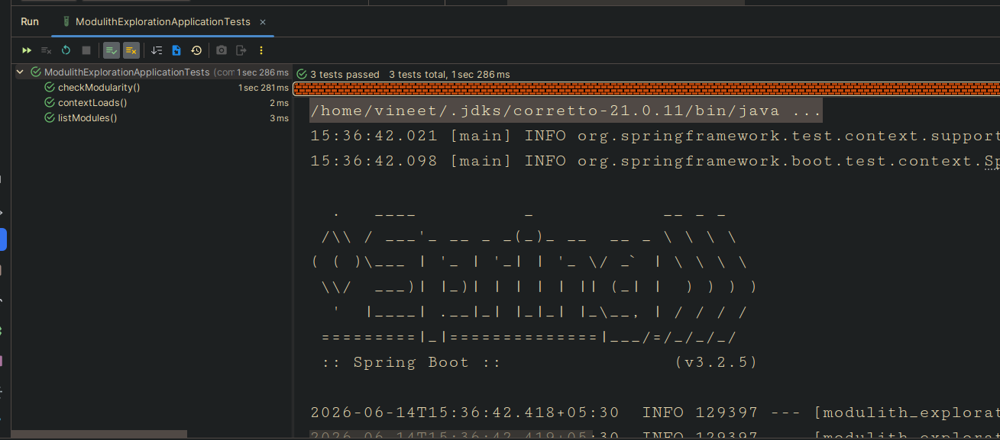
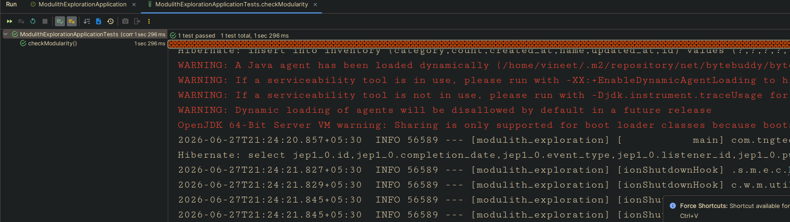
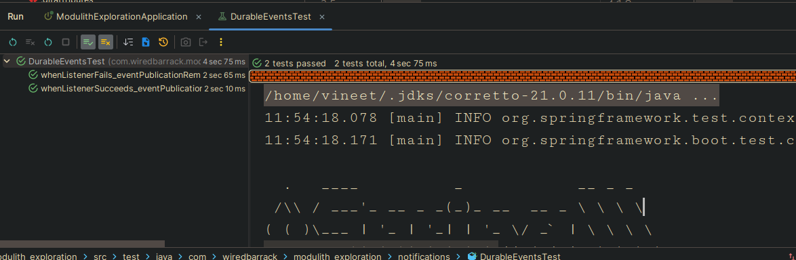
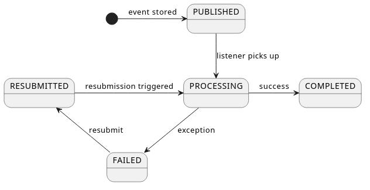

# Exploring Events In Spring Modulith 

In our last article, we discussed the basics of spring modulith and at this point we know that spring modulith does not magically turns our monolith into a modular monolith but instead provide a set of tests that help us to track places where we violate the modular design patterns and provide a set of tools that help us to reduce coupling and increase cohesion in our application, And one such tool is - Events.

But before we dive straight into events lets first complete a few basic concepts that we did not cover in our last article, this will help us to harden our foundation and have a quick refresher through our last position on code.

# Left over topics:
0. Named Interfaces
1. Open Application Modules
2. Defining Explicit Application Module Dependencies
3. Customizing Module Detection Strategy
4. Customizing Named Interface Detection

So, before diving into the article, I have refactored the code to have proper exceptions and a generic exception.
Also, services has been replaced by interfaces and their implementation has been moved to internal packages. We made all classes except the service interfaces as package private to adhere to intended architecture

One more improvement, I did is that we have a public record per domain for cross domain communication while we keep our DB entity private to the domain .
At this point all our tests pass!


```

.
├── main
│   ├── java
│   │   └── com
│   │       └── wiredbarrack
│   │           └── modulith_exploration
│   │               ├── inventory
│   │               │   ├── internal
│   │               │   │   ├── InventoryDataSeeder.java
│   │               │   │   ├── InventoryEntity.java
│   │               │   │   ├── InventoryMapper.java
│   │               │   │   ├── InventoryRepository.java
│   │               │   │   └── InventoryServiceImpl.java
│   │               │   ├── Inventory.java
│   │               │   └── InventoryService.java
│   │               ├── ModulithExplorationApplication.java
│   │               ├── notifications
│   │               │   ├── internal
│   │               │   │   ├── NotificationDataSeeder.java
│   │               │   │   ├── NotificationEntity.java
│   │               │   │   ├── NotificationMapper.java
│   │               │   │   ├── NotificationRepository.java
│   │               │   │   └── NotificationServiceImpl.java
│   │               │   ├── Notification.java
│   │               │   └── NotificationService.java
│   │               ├── orders
│   │               │   ├── internal
│   │               │   │   ├── OrderDataSeeder.java
│   │               │   │   ├── OrderEntity.java
│   │               │   │   ├── OrderMapper.java
│   │               │   │   ├── OrderRepository.java
│   │               │   │   └── OrderSeviceImpl.java
│   │               │   ├── Order.java
│   │               │   └── OrderSevice.java
│   │               ├── users
│   │               │   ├── internal
│   │               │   │   ├── UserDataSeeder.java
│   │               │   │   ├── UserEntity.java
│   │               │   │   ├── UserMapper.java
│   │               │   │   ├── UserRepository.java
│   │               │   │   └── UserServiceImpl.java
│   │               │   ├── User.java
│   │               │   └── UserService.java
│   │               └── utility
│   │                   └── DatabaseBackupUtility.java
│   └── resources
│       ├── application.yml
│       ├── backup.sql
│       ├── static
│       └── templates
└── test
    └── java
        └── com
            └── wiredbarrack
                └── modulith_exploration
                    └── ModulithExplorationApplicationTests.java
```
This works fine if we have to expose a few DTOs/records per domain, but if a domain somehow needs to expose more than few DTOs we would like to have a separate package for the dtos
but once we move it to that package, it would not be part of public api anymore

That's where Named Interfaces come to our rescue,
With the help of Named interfaces, we can define some sub-packages as public and thus part of public API

Lets create a subpackage `dto` for each of our domains and move our records there.

```

├── main
│   ├── java
│   │   └── com
│   │       └── wiredbarrack
│   │           └── modulith_exploration
│   │               ├── inventory
│   │               │   ├── dto
│   │               │   │   └── InventoryService.java
│   │               │   ├── internal
│   │               │   │   ├── InventoryDataSeeder.java
│   │               │   │   ├── InventoryEntity.java
│   │               │   │   ├── InventoryMapper.java
│   │               │   │   ├── InventoryRepository.java
│   │               │   │   └── InventoryServiceImpl.java
│   │               │   └── Inventory.java
│   │               ├── ModulithExplorationApplication.java
│   │               ├── notifications
│   │               │   ├── dto
│   │               │   │   └── Notification.java
│   │               │   ├── internal
│   │               │   │   ├── NotificationDataSeeder.java
│   │               │   │   ├── NotificationEntity.java
│   │               │   │   ├── NotificationMapper.java
│   │               │   │   ├── NotificationRepository.java
│   │               │   │   └── NotificationServiceImpl.java
│   │               │   └── NotificationService.java
│   │               ├── orders
│   │               │   ├── dto
│   │               │   │   └── Order.java
│   │               │   ├── internal
│   │               │   │   ├── OrderDataSeeder.java
│   │               │   │   ├── OrderEntity.java
│   │               │   │   ├── OrderMapper.java
│   │               │   │   ├── OrderRepository.java
│   │               │   │   └── OrderSeviceImpl.java
│   │               │   └── OrderSevice.java
│   │               ├── users
│   │               │   ├── dto
│   │               │   │   └── User.java
│   │               │   ├── internal
│   │               │   │   ├── UserDataSeeder.java
│   │               │   │   ├── UserEntity.java
│   │               │   │   ├── UserMapper.java
│   │               │   │   ├── UserRepository.java
│   │               │   │   └── UserServiceImpl.java
│   │               │   └── UserService.java
│   │               └── utility
│   │                   └── DatabaseBackupUtility.java
│   └── resources
│       ├── application.yml
│       ├── backup.sql
│       ├── static
│       └── templates
└── test
    └── java
        └── com
            └── wiredbarrack
                └── modulith_exploration
                    └── ModulithExplorationApplicationTests.java
```
 
I have started to consume the `Inventory` record in `placeOrder` method of `OrderServiceImpl` class, but I am not able to use it in the `InventoryRepository` class because it is in a different package and thus not part of public API.
```
        Inventory inventory = inventoryService.acquireInventoryItem(order.id(), order.itemCount());
        log.info("Inventory updated for item id : {} with count : {}", inventory.id(), inventory.count());
```
Note: if we don't call any of the methods of `Inventory` record in `OrderServiceImpl` class, then it will not be a problem and modularity test will pass, but as soon as we call any of the methods of `Inventory` record in `OrderServiceImpl` class, it will fail because `Inventory` record is not part of public API anymore.
So our Modularity test shall fail:

```
org.springframework.modulith.core.Violations: - Module 'orders' depends on non-exposed type com.wiredbarrack.modulith_exploration.inventory.dto.Inventory within module 'inventory'!
Method <com.wiredbarrack.modulith_exploration.orders.internal.OrderSeviceImpl.placeOrder(com.wiredbarrack.modulith_exploration.orders.dto.Order)> calls method <com.wiredbarrack.modulith_exploration.inventory.dto.Inventory.id()> in (OrderSeviceImpl.java:43)
- Module 'orders' depends on non-exposed type com.wiredbarrack.modulith_exploration.inventory.dto.Inventory within module 'inventory'!
Method <com.wiredbarrack.modulith_exploration.orders.internal.OrderSeviceImpl.placeOrder(com.wiredbarrack.modulith_exploration.orders.dto.Order)> calls method <com.wiredbarrack.modulith_exploration.inventory.dto.Inventory.count()> in (OrderSeviceImpl.java:43)

	at org.springframework.modulith.core.Violations.and(Violations.java:144)
	at java.base/java.util.stream.ReduceOps$1ReducingSink.accept(ReduceOps.java:80)
	at java.base/java.util.stream.ReferencePipeline$3$1.accept(ReferencePipeline.java:197)
	at java.base/java.util.HashMap$ValueSpliterator.forEachRemaining(HashMap.java:1787)
	at java.base/java.util.stream.Streams$ConcatSpliterator.forEachRemaining(Streams.java:735)
	at java.base/java.util.stream.AbstractPipeline.copyInto(AbstractPipeline.java:509)
	at java.base/java.util.stream.AbstractPipeline.wrapAndCopyInto(AbstractPipeline.java:499)
	at java.base/java.util.stream.ReduceOps$ReduceOp.evaluateSequential(ReduceOps.java:921)
	at java.base/java.util.stream.AbstractPipeline.evaluate(AbstractPipeline.java:234)
	at java.base/java.util.stream.ReferencePipeline.reduce(ReferencePipeline.java:657)
	at org.springframework.modulith.core.ApplicationModules.detectViolations(ApplicationModules.java:475)
	at org.springframework.modulith.core.ApplicationModules.verify(ApplicationModules.java:440)
	at com.wiredbarrack.modulith_exploration.ModulithExplorationApplicationTests.checkModularity(ModulithExplorationApplicationTests.java:23)
	at java.base/java.lang.reflect.Method.invoke(Method.java:580)
	at java.base/java.util.ArrayList.forEach(ArrayList.java:1596)
	at java.base/java.util.ArrayList.forEach(ArrayList.java:1596)
```
To overcome this problem, we use named interfaces to expose the `Inventory` record to other modules.
Thus, we add `package-info.java` file in the `inventory.dto` package and expose the `Inventory` record to other modules using named interfaces.

```
@org.springframework.modulith.NamedInterface("dto")
package com.wiredbarrack.modulith_exploration.inventory.dto;
```
Now, our tests pass:



Also, to strictly define the allowed dependencies for a module we can add `@org.springframework.modulith.AllowedDependencies` annotation to the `package-info.java` file of a module. For example:
```
@org.springframework.modulith.ApplicationModule(
        allowedDependencies = {"inventory", "inventory::dto", "notifications"}
)
```

Still we have an problem, that our `OrderService` has an hard dependency on `NotificationService`(High Coupling), this has two-fold issues: 1. that application imports it causing high coupling, 2. It hampers independent testing of `OrderService`, as we need to mock it and any time NotifcationService changes, we need to touch every module that uses it.
It also means that we will have to touch the class whenever we would like to integrate further functionality with the business event order completion.

To overcome this problem, we can use the `ApplicationEvents` already provided by Modulith to decouple services


Step 1: Create a new event class `OrderPlacedEvent` in the `orders` module, which will be published when an order is placed.
```java
@Getter
@Builder
public class OrderPlaced {
    private Integer id;
}
```

Step 2: In the `OrderServiceImpl` class, publish the `OrderPlacedEvent` when an order is placed.
```java

private final ApplicationEventPublisher events;

...
log.info("Order Placed with id : {}", orderEntity.getId());
events.publishEvent(OrderPlaced.builder().id(orderEntity.getId()).build());
return mapper.toRecord(orderEntity);
...
```
Before Spring Modulith, developers who wanted to decouple modules but still keep things transactional would reach for vanilla Spring's async event listener pattern:
```java

@Component
class OrderEventListener {

    @Async
    @TransactionalEventListener
    void onOrderPlaced(OrderPlaced event) {
        // This runs AFTER the original transaction commits — good.
        // But what happens if this method throws? Or the JVM crashes before this line runs?
        notificationService.saveNotification("Order placed!");
    }
}
```


This pattern decouples the original transaction from the notification work — when `placeOrder` commits, the listener fires asynchronously. That sounds ideal.

But it has a critical flaw: **if the listener throws an exception, the event is silently lost.** There is no retry, no record, no safety net. The order exists in your database but the notification was never sent, and your system has no way to know that.

To make the listener itself transactional (so it can roll back on failure), you'd add `@Transactional` with `REQUIRES_NEW`:

```java
@Component
class OrderEventListener {

    @Async
    @Transactional(propagation = Propagation.REQUIRES_NEW) // its own transaction
    @TransactionalEventListener                             // runs after original tx commits
    void onOrderPlaced(OrderPlaced event) {
        notificationService.saveNotification("Order placed!");
    }
}
```


This is the correct approach — but it is **boilerplate you have to remember to write every single time**. Forget `REQUIRES_NEW` and the listener silently runs outside a transaction. Forget `@Async` and a slow listener blocks the calling thread.

Spring Modulith solves this with a single annotation `@ApplicationModuleListener`:

Step 3: In the `notifications` package, listen for the `OrderPlacedEvent` and send a notification when the event is received.
```java
@Slf4j
@Component
@RequiredArgsConstructor
class OrderEventListener {

    private final NotificationService notificationService;

    @ApplicationModuleListener
    void onOrderPlaced(OrderPlaced event) {
        log.info("Received OrderPlaced event for order id: {}", event.getId());
        notificationService.saveNotification("Your order has been placed successfully!");
    }
}

```

`@ApplicationModuleListener` is a composed annotation that is equivalent to writing all three annotations correctly every time. But it goes further — it plugs into the **Event Publication Registry**, which is what gives us true durability.


### How the Registry Works

When `placeOrder` calls `events.publishEvent(OrderPlaced.builder().id(orderId).build())`, Spring Modulith does not just fire and forget. It intercepts the publication and:

1. **Finds all `@TransactionalEventListener`-annotated methods** (which includes `@ApplicationModuleListener`) that are interested in this event type.
2. **Writes one row per listener** into a dedicated `event_publication` table — as part of the **same original transaction**. If the `placeOrder` transaction rolls back, the publication row is never written either. Event publication and business data are always consistent.
3. **Wraps each listener in an AOP interceptor.** When the listener completes successfully, the interceptor marks the row as complete. When the listener throws, the row stays in an incomplete state — ready for retry.

This is the outbox pattern, baked into the framework.

```
┌──────────────────────────────────────────────────────────┐
│  placeOrder() — @Transactional                           │
│                                                          │
│   1. Save order to DB                                    │
│   2. events.publishEvent(OrderPlaced)  ──────────────┐   │
│                                                      │   │
│   ┌── Modulith intercepts ───────────────────────┐  │   │
│   │  Finds listeners for OrderPlaced             │  │   │
│   │  INSERT INTO event_publication (1 row)       │◄─┘   │
│   └──────────────────────────────────────────────┘       │
│                                                          │
│  COMMIT ─ both order row & publication row committed     │
└──────────────────────────────────────────────────────────┘
            │
            │  After commit
            ▼
┌──────────────────────────────────────────────────────────┐
│  OrderEventListener.onOrderPlaced()  (async, new tx)     │
│                                                          │
│  SUCCESS → UPDATE event_publication SET status=COMPLETED │
│  FAILURE → row untouched, status stays PUBLISHED/FAILED  │
└──────────────────────────────────────────────────────────┘
```


### Setting up the Registry

The registry needs a persistence backend. Spring Modulith provides starter POMs for the most common technologies:

| Starter | When to use |
|---|---|
| `spring-modulith-starter-jpa` | Already using JPA — registry reuses your JPA setup |
| `spring-modulith-starter-jdbc` | Lighter alternative; bypasses JPA even in JPA apps |
| `spring-modulith-starter-mongodb` | MongoDB (requires a replica set) |
| `spring-modulith-starter-neo4j` | Neo4j via Spring Data |

We are using `spring-modulith-starter-jpa` in this project:

```xml
<!-- pom.xml — already in our project -->
<dependency>
    <groupId>org.springframework.modulith</groupId>
    <artifactId>spring-modulith-starter-jpa</artifactId>
    <version>2.0.7</version>
</dependency>
```

The JPA starter auto-creates the `event_publication` table on startup (controlled by `spring.modulith.events.jdbc.schema-initialization.enabled`, defaults to `true`). Each row stores the serialized event payload as JSON using Jackson — which is why `OrderPlaced` must be Jackson-serializable (our Lombok-generated getters take care of this).

I have added following tests to verify the working of the above implementation.

```java

@Test
void checkEventListenerForOrderNotification(){
    var modules = ApplicationModules.of(ModulithExplorationApplication.class);

    var ordersModule        = modules.getModuleByName("orders").orElseThrow();
    var notificationsModule = modules.getModuleByName("notifications").orElseThrow();

    // 1. OrderPlaced must be in the orders::dto named interface (part of public API)
    boolean orderPlacedIsPublic = ordersModule.getNamedInterfaces()
            .stream()
            .filter(ni -> "dto".equals(ni.getName()))
            .anyMatch(ni -> ni.contains(OrderPlaced.class));

    org.junit.jupiter.api.Assertions.assertTrue(
            orderPlacedIsPublic,
            "OrderPlaced must be in the orders::dto named interface to be consumable by other modules"
    );

    // 2. notifications module must listen to at least one event from the orders package
    var eventsListenedTo = notificationsModule.getEventsListenedTo(modules);

    boolean listensToOrderEvent = eventsListenedTo.stream()
            .anyMatch(e -> e.getPackageName()
                    .startsWith("com.wiredbarrack.modulith_exploration.orders"));

    org.junit.jupiter.api.Assertions.assertTrue(
            listensToOrderEvent,
            "notifications module must have an @ApplicationModuleListener for an orders event, " +
                    "but currently listens to: " + eventsListenedTo
    );
}
```

and
 ```java

@ApplicationModuleTest(ApplicationModuleTest.BootstrapMode.DIRECT_DEPENDENCIES)
class NotificationsModuleTests {

    @Test
    void checkEventListenerForOrderNotification(Scenario scenario) {

        var event = OrderPlaced.builder().id(42).build();

        scenario.publish(event)
                .andWaitForStateChange(() -> event);
    }
}
 ```

### Durable Events:
Now, consider a scenario where the `notifications` module is down when the `OrderPlaced` event is published. In this case, the event will be lost and the notification will not be sent. To overcome this problem, we can use durable events. Durable events are persisted in the database and can be replayed when the module is back up.
So, spring modulith maintains a table `event_publication` in the database to store the events. When a module is down, the events are stored in this table and when the module is back up, the events are replayed.


### Enabling Automatic Re-publication on Restart

When the application comes back up after a crash, it can automatically re-deliver any events that were not completed before the shutdown:

```yaml
# application.yml
spring:
  modulith:
    events:
      republish-outstanding-events-on-restart: true
```

With this enabled, any `event_publication` row without a completion date gets re-delivered to its listener on the next application startup.

Automatic re-publication of the events can be enabled via the `spring.modulith.events.republish-outstanding-events-on-restart property`.

To mimic this flow, lets deliberately add exception to notification service and check if event is stored with which state in `event_publication` table.

```java

@Slf4j
@SpringBootTest
class DurableEventsTest {

    @Autowired
    ApplicationEventPublisher eventPublisher;

    @Autowired
    TransactionTemplate transactionTemplate;

    @Autowired
    JdbcTemplate jdbcTemplate;

    @MockBean
    NotificationService notificationService;

    @BeforeEach
    void setUp() {
        jdbcTemplate.execute("DELETE FROM event_publication");
        reset(notificationService);
    }

    @Test
    void whenListenerFails_eventPublicationRemainsIncomplete() throws InterruptedException {

        when(notificationService.saveNotification(anyString()))
                .thenThrow(new RuntimeException("Simulated notification failure!"));

        transactionTemplate.executeWithoutResult(status ->
                eventPublisher.publishEvent(OrderPlaced.builder().id(1).build()));

        Thread.sleep(2000);

        List<Map<String, Object>> publications = jdbcTemplate.queryForList("SELECT * FROM event_publication");

        logPublicationTable(publications, "FAILURE SCENARIO");

        assertFalse(publications.isEmpty(),
                "event_publication must have at least one row — event was published");

        boolean hasIncompletePublication = publications.stream()
                .anyMatch(row -> row.get("completion_date") == null);

        assertTrue(hasIncompletePublication,
                "completion_date must be null — listener threw, event is pending re-delivery");

        log.info("FAILURE SCENARIO confirmed: event stored safely, completion_date = null, awaiting re-delivery.");
    }

    @Test
    void whenListenerSucceeds_eventPublicationIsMarkedComplete() throws InterruptedException {

        when(notificationService.saveNotification(anyString()))
                .thenReturn(new Notification(99, "Your order has been placed successfully!", "SENT"));

        transactionTemplate.executeWithoutResult(status ->
                eventPublisher.publishEvent(OrderPlaced.builder().id(10).build()));

        Thread.sleep(2000);

        List<Map<String, Object>> publications = jdbcTemplate.queryForList("SELECT * FROM event_publication");

        logPublicationTable(publications, "SUCCESS SCENARIO");

        assertFalse(publications.isEmpty(),
                "event_publication must have at least one row — event was published");

        boolean hasCompletedPublication = publications.stream()
                .anyMatch(row -> row.get("completion_date") != null);

        assertTrue(hasCompletedPublication,
                "completion_date must be set — listener succeeded, event delivery is complete");

        log.info("SUCCESS SCENARIO confirmed: event published, listener ran, completion_date is set.");
    }

    private void logPublicationTable(List<Map<String, Object>> publications, String scenario) {
        log.info("=== event_publication — {} ({} rows) ===", scenario, publications.size());
        for (Map<String, Object> row : publications) {
            log.info("  id              : {}", row.get("id"));
            log.info("  event_type      : {}", row.get("event_type"));
            log.info("  listener_id     : {}", row.get("listener_id"));
            log.info("  publication_date: {}", row.get("publication_date"));
            log.info("  completion_date : {}", row.get("completion_date")); // null = not delivered yet
            log.info("  serialized_event: {}", row.get("serialized_event"));
            log.info("  ----");
        }
    }
}

```



Spring Modulith's event_publication table doesn't actually store a "status" enum like PUBLISHED/PROCESSING/COMPLETED/FAILED. It's simpler — it just tracks incomplete vs completed via a single nullable timestamp column.

Inferring the "status" of an event publication is purely based on COMPLETION_DATE:
StateMeaningCOMPLETION_DATE IS NULLIncomplete — either still processing, never got picked up, or threw an exception that wasn't handled by a retry/completion mechanismCOMPLETION_DATE IS NOT NULLCompleted — the listener finished successfully
There's no FAILED row state in the table itself. If a listener throws an exception:

By default, the row stays incomplete (COMPLETION_DATE stays NULL), and Modulith's CompletionMode (configurable) decides whether to retry it on next republish.
There's no separate persisted "this failed" marker — incomplete is the failed/pending signal, and Modulith can't distinguish "still mid-processing right now" from "errored and waiting for retry" just by looking at the row. That distinction lives in your application logs / exception handling, not the table.

But after Modulith 2.0, they have added `status`, `Completion_attempts`, `Last_resubmission_date` fields to track events, the event lifecycle is now more robust and can be tracked easily after modulith 2.0.
Following image shows event lifecycle:

source: https://docs.spring.io/spring-modulith/reference/events.html


Publication states

Each event publication has a EventPublication.Status:

    PUBLISHED – The publication was stored and is waiting to be processed (or is about to be picked up).

    PROCESSING – A listener has claimed the publication and is executing. The interceptor around the listener sets this before invoking the listener and sets it to COMPLETED or FAILED when the listener returns.

    COMPLETED – The listener finished successfully. A completion date is set (unless the completion mode is DELETE).

    FAILED – The listener threw an exception, or the publication was marked failed by the staleness mechanism (see Event Publication Staleness and Automatic Marking as Failed).

    RESUBMITTED – A previously failed publication was resubmitted and is again pending processing.


### Event Publication Staleness and Automatic Failure Marking

Consider a scenario: the JVM crashes in the middle of `OrderEventListener.onOrderPlaced()`. The row is in `PROCESSING`. The application restarts.

Without staleness detection, this row stays in `PROCESSING` forever. You cannot safely resubmit it — you do not know if it's still running somewhere (it's not, but the database does not know that) or if it crashed.

Spring Modulith 2.0 introduces a **Staleness Monitor** — a background scheduled task that looks for rows stuck in `PUBLISHED`, `PROCESSING`, or `RESUBMITTED` that are older than a configured threshold, and marks them `FAILED`. Once they are `FAILED`, you can safely resubmit them.

Configure the thresholds in `application.yml`:

```yaml
spring:
  modulith:
    events:
      staleness:
        published: 10m    # rows stuck in PUBLISHED for > 10 min → mark FAILED
        processing: 5m    # rows stuck in PROCESSING for > 5 min → mark FAILED
        resubmitted: 10m  # rows stuck in RESUBMITTED for > 10 min → mark FAILED
```


> **Note:** If all three values are zero (the default), the Staleness Monitor does not register its scheduled task at all — no overhead for applications that don't need it.

The interval at which the monitor runs defaults to the minimum of the configured staleness durations. You can override it explicitly if needed.


### Working with Failed Publications: The Resubmission API

The `spring-modulith-events-api` artifact exposes three Spring beans that let you manage event publications programmatically. Add it to your `pom.xml`:

```xml
<!-- pom.xml -->
<dependency>
    <groupId>org.springframework.modulith</groupId>
    <artifactId>spring-modulith-events-api</artifactId>
    <version>2.0.7</version>
</dependency>
```

The three beans:

| Bean | Purpose |
|---|---|
| `FailedEventPublications` | Resubmit only `FAILED` publications |
| `IncompleteEventPublications` | Resubmit any incomplete publication (failed, stale, etc.) |
| `CompletedEventPublications` | Access and purge completed publications |

#### Resubmitting Failed Events

```java
@Component
@RequiredArgsConstructor
class EventHousekeeping {

    private final FailedEventPublications failedEventPublications;
    private final IncompleteEventPublications incompleteEventPublications;
    private final CompletedEventPublications completedEventPublications;

    // Call this on a schedule, or from an admin endpoint
    void resubmitFailed() {
        // Resubmit all failed publications, up to 10 at a time
        failedEventPublications.resubmit(
            ResubmissionOptions.defaults()
                .withBatchSize(10)
        );
    }

    void resubmitOldIncomplete() {
        // Resubmit incomplete publications that are at least 5 minutes old
        incompleteEventPublications.resubmitIncompletePublications(
            ResubmissionOptions.defaults()
                .withMinAge(Duration.ofMinutes(5))
        );
    }

    void purgeOldCompleted() {
        // Delete completed event_publication rows older than 1 hour to keep the table lean
        completedEventPublications.deletePublicationsOlderThan(Duration.ofHours(1));
    }
}
```

#### `ResubmissionOptions` in Detail

`ResubmissionOptions` is a builder that controls exactly how resubmission works:

```java
ResubmissionOptions options = ResubmissionOptions.defaults()
    .withBatchSize(20)                            // process at most 20 at a time
    .withMinAge(Duration.ofMinutes(10))           // only consider publications older than 10 min
    .withFilter(pub ->                            // custom predicate
        pub.getCompletionAttempts() < 3           // stop after 3 tries
    );
```

When resubmission runs:
1. The row transitions: `FAILED` → `RESUBMITTED`
2. `last_resubmission_date` is set to now
3. The listener is invoked again asynchronously
4. The row transitions: `RESUBMITTED` → `PROCESSING` (attempt count incremented) → `COMPLETED` or `FAILED`

---


## Completion Modes (insert AFTER Resubmission API section)

---

### Event Publication Completion Modes

By default, when a listener completes successfully, Modulith sets `completion_date` on the row and leaves it in the table. This means your `event_publication` table **grows unboundedly** unless you purge it manually.

Modulith provides three completion modes via `spring.modulith.events.completion-mode`:

| Mode | Behaviour | Use when |
|---|---|---|
| `UPDATE` (default) | Sets `completion_date` on success. Row stays. Manual purge required. | You need to audit completed events |
| `DELETE` | Deletes the row on success. Nothing to purge. `CompletedEventPublications` returns empty. | You only care about failures |
| `ARCHIVE` | On success: copies row to `event_publication_archive` table with `completion_date` set, then deletes the original row. Completed events still queryable via `CompletedEventPublications`. | You want audit trail but a lean active table |

Configure in `application.yml`:

```yaml
spring:
  modulith:
    events:
      completion-mode: DELETE   # or UPDATE (default) or ARCHIVE
```

#### Demonstrating DELETE mode

If you switch to `DELETE` mode and run the success scenario in `DurableEventsTest`, the `event_publication` table will be empty after the listener succeeds:

```java
@Test
void whenCompletionModeIsDelete_tableIsEmptyAfterSuccess() throws InterruptedException {
    // With spring.modulith.events.completion-mode=DELETE in test config:

    when(notificationService.saveNotification(anyString()))
        .thenReturn(new Notification(99, "OK", "SENT"));

    transactionTemplate.executeWithoutResult(status ->
        eventPublisher.publishEvent(OrderPlaced.builder().id(10).build()));

    Thread.sleep(2000);

    List<Map<String, Object>> publications =
        jdbcTemplate.queryForList("SELECT * FROM event_publication");

    // With DELETE mode — the row is gone after successful delivery
    assertTrue(publications.isEmpty(),
        "With DELETE completion mode, completed publications are removed immediately");
}
```

> **Rule of thumb:** Use `DELETE` during development for a clean slate between runs. Use `UPDATE` or `ARCHIVE` in production for observability.

---


## Event Serialization (insert AFTER Completion Modes, brief section)

---

### How Events Are Serialized

Each row in `event_publication` stores the full event object as JSON in the `serialized_event` column. You can see this in the output of our `DurableEventsTest`:

```
serialized_event: {"id":1}
```

Spring Modulith uses Jackson by default (`JacksonEventSerializer`), which is automatically configured from your application's `ObjectMapper`. Our `OrderPlaced` class is serializable because Lombok's `@Data` generates the required getters:

```java
@Builder
@Data
@AllArgsConstructor
@NoArgsConstructor
public class OrderPlaced {
    private Integer id;
}
```

**What this means for you:**
- Any field in your event class must be Jackson-serializable
- Avoid putting JPA entities directly in events — use IDs or dedicated event records instead
- If you need custom serialization, implement `EventSerializer` and register it as a `@Bean`

**Customizing the publication timestamp:**

By default, Modulith timestamps publications using `Clock.systemUTC()`. In tests, you might want a fixed clock:

```java
@TestConfiguration
class EventTestConfig {
    @Bean
    Clock testClock() {
        return Clock.fixed(Instant.now(), ZoneOffset.UTC);
    }
}
```

---

## Testing with PublishedEvents (insert AFTER the existing NotificationsModuleTests section)

---

### Testing Events from the Publisher's Side

The `Scenario` API (which we used in `NotificationsModuleTests`) tests event consumption — you publish an event and verify the state change. But sometimes you want to test from the **publisher's side**: verify that placing an order actually fires the correct event.

Spring Modulith's `@ApplicationModuleTest` supports two special test method parameters for this:

#### Option A: `PublishedEvents`

```java
// Add to: src/test/java/com/wiredbarrack/modulith_exploration/orders/OrdersModuleTests.java

package com.wiredbarrack.modulith_exploration.orders;

import com.wiredbarrack.modulith_exploration.orders.dto.Order;
import com.wiredbarrack.modulith_exploration.orders.dto.OrderPlaced;
import org.junit.jupiter.api.Test;
import org.springframework.beans.factory.annotation.Autowired;
import org.springframework.modulith.test.ApplicationModuleTest;
import org.springframework.modulith.test.PublishedEvents;

import static org.assertj.core.api.Assertions.assertThat;

@ApplicationModuleTest
class OrdersModuleTests {

    @Autowired
    OrderSevice orderService;

    @Test
    void placeOrder_publishesOrderPlacedEvent(PublishedEvents events) {
        // Arrange
        var order = new Order(null, 1, "PENDING", 2);

        // Act
        orderService.placeOrder(order);

        // Assert — verify the event was published with the right data
        var published = events.ofType(OrderPlaced.class)
                .matching(OrderPlaced::getId, id -> id != null);

        assertThat(published).hasSize(1);
    }
}
```

`PublishedEvents` captures all events published during the test method's execution. The `ofType(…).matching(…)` chain lets you filter by event type and field values.

#### Option B: `AssertablePublishedEvents` (fluent AssertJ style)

If you are already using AssertJ in your tests, `AssertablePublishedEvents` gives you a more expressive syntax:

```java
@Test
void placeOrder_publishesOrderPlacedEvent(AssertablePublishedEvents events) {
    var order = new Order(null, 1, "PENDING", 2);
    orderService.placeOrder(order);

    assertThat(events)
        .contains(OrderPlaced.class)
        .matching(OrderPlaced::getId, id -> id != null);
}
```

The difference is purely stylistic — `AssertablePublishedEvents` folds the assertion into the fluent `assertThat(events)` chain so you do not need a separate variable.

**Key points:**
- Both are injected at the **test method level** (as parameters), not the class level
- They only capture events published during that specific test method's execution
- They complement the `Scenario` API: use `Scenario` to test listeners (consumer side), use `PublishedEvents` to test publishers (producer side)

---

## Event Externalization (final major section)

---

### Externalizing Events to Message Brokers

Everything we have covered so far is about events within the JVM — one module talking to another in the same process. But what if an external system needs to react to an `OrderPlaced` event? A shipping service, an analytics pipeline, a third-party notification provider?

This is where **event externalization** comes in. Spring Modulith lets you publish selected events to a message broker (Kafka, RabbitMQ, JMS, etc.) with the same durability guarantees as internal events — because externalization is implemented as a `@TransactionalEventListener`, which means the **Event Publication Registry tracks it too**.

#### The Three Steps of Externalization

When an event is published, Modulith performs three steps to externalize it:

**Step 1 — Event Selection:** Is this event supposed to leave the JVM?
By default, only events annotated with `@Externalized` are selected.

**Step 2 — Message Preparation (optional):** Transform the event into a payload suitable for external consumers. You might strip internal fields or map to a different DTO.

**Step 3 — Routing:** Where does the message go? Each broker has its own concept (topic, exchange, queue). Modulith derives a default target from the class name: for a base package of `com.wiredbarrack.modulith_exploration`, an event `orders.dto.OrderPlaced` would publish to `orders.dto.OrderPlaced` by default.

#### Available Broker Adapters

| Artifact | Broker | Routing |
|---|---|---|
| `spring-modulith-events-kafka` | Apache Kafka | Routing key → Kafka topic and message key |
| `spring-modulith-events-amqp` | RabbitMQ / any AMQP | Routing key → AMQP routing key |
| `spring-modulith-events-jms` | JMS | No routing keys supported |
| `spring-modulith-events-messaging` | Spring Integration / Messaging | Target resolves to a `MessageChannel` bean name |

Add the relevant artifact to your `pom.xml` and the auto-configuration takes over.

---

### Annotation-Based Configuration with `@Externalized`

The simplest way to externalize an event is to annotate it with `@Externalized`:

```java
// Simplest form — target is derived automatically from the class name
@Externalized
public class OrderPlaced {
    private Integer id;
}
```

To specify an explicit topic and a routing key, use the `target::key` pattern. Both sides support SpEL expressions where `#this` refers to the event instance:

```java
// Publish to the "orders.placed" topic, with the order ID as the routing key
@Externalized("orders.placed::#{#this.getId()}")
public class OrderPlaced {
    private Integer id;
}
```

For routing key logic that is too complex for a single expression, delegate to a Spring bean:

```java
// Delegate key calculation to a bean
@Externalized("orders.placed::#{@orderRoutingStrategy.keyFor(#this)}")
public class OrderPlaced {
    private Integer id;
}

@Component("orderRoutingStrategy")
class OrderRoutingStrategy {
    public String keyFor(OrderPlaced event) {
        // any logic here
        return "order-" + event.getId();
    }
}
```

---

### Programmatic Configuration with `EventExternalizationConfiguration`

For full control over selection, mapping, and routing, register an `EventExternalizationConfiguration` bean:

```java
@Configuration
class ExternalizationConfig {

    @Bean
    EventExternalizationConfiguration eventExternalizationConfiguration() {
        return EventExternalizationConfiguration.externalizing()
            // (1) Which events to externalize
            .select(EventExternalizationConfiguration.annotatedAsExternalized())
            // (2) Map OrderPlaced to a leaner external DTO before sending
            .mapping(OrderPlaced.class, event ->
                new ExternalOrderEvent(event.getId(), Instant.now())
            )
            // (3) Use the order ID as the routing/partition key
            .routeKey(OrderPlaced.class, e -> String.valueOf(e.getId()))
            .build();
    }
}

// The leaner DTO for external consumers — no internal fields exposed
record ExternalOrderEvent(Integer orderId, Instant occurredAt) {}
```

This approach is useful when:
- You want to control exactly which fields external consumers see
- Your routing key requires transformation logic
- You want to add broker-specific headers to the message

---

### Serialization Safety: Serialize Externalization

Externalization runs as a transactional event listener, which means multiple threads can be sending to the broker concurrently — especially when resubmitting a backlog of failed publications. This can cause ordering issues at the broker.

To enforce serial execution (one event sent at a time), set:

```yaml
spring:
  modulith:
    events:
      externalization:
        serialize-externalization: true
```

This adds a lock so that only one externalization interaction with the broker happens at a time. Use this when event ordering at the broker matters or when you are resubmitting large backlogs.

---

### A Note on Externalization and the Registry

This is the elegant part: externalization is **just another transactional event listener**. This means:

- A row is written to `event_publication` for the externalization listener, just like for internal listeners
- If the broker is unavailable and the send fails, the row stays `FAILED`
- You can resubmit failed external event publications using the same `FailedEventPublications` API described above
- The same staleness detection, completion modes, and resubmission options apply

There is no separate outbox table or mechanism to learn. The same durable event pattern that guards internal module communication guards external broker communication too.

---

## QUICK REFERENCE: Configuration Properties

```yaml
spring:
  modulith:
    events:
      # Re-deliver incomplete events on application restart
      republish-outstanding-events-on-restart: true

      # What to do with completed event_publication rows
      # UPDATE (default) | DELETE | ARCHIVE
      completion-mode: UPDATE

      # Mark stuck publications as FAILED after these durations
      staleness:
        published: 10m
        processing: 5m
        resubmitted: 10m

      # JDBC schema auto-creation (set false if using Flyway/Liquibase)
      jdbc:
        schema-initialization:
          enabled: true

      # Externalization
      externalization:
        serialize-externalization: false  # true = one broker send at a time
```

---

## QUICK REFERENCE: Dependency Additions to pom.xml

```xml
<!-- For the resubmission API (FailedEventPublications, CompletedEventPublications, etc.) -->
<dependency>
    <groupId>org.springframework.modulith</groupId>
    <artifactId>spring-modulith-events-api</artifactId>
    <version>2.0.7</version>
</dependency>

<!-- For Kafka externalization (add instead of the above if externalizing to Kafka) -->
<dependency>
    <groupId>org.springframework.modulith</groupId>
    <artifactId>spring-modulith-events-kafka</artifactId>
    <version>2.0.7</version>
</dependency>

<!-- For RabbitMQ/AMQP externalization -->
<dependency>
    <groupId>org.springframework.modulith</groupId>
    <artifactId>spring-modulith-events-amqp</artifactId>
    <version>2.0.7</version>
</dependency>
```

